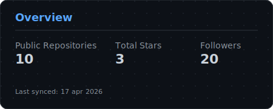

## Hi! I'm Enrico Carbonaro

I am a passionate and determined student, always ready to put myself out there and devote time and energy to the projects I undertake.  
I have a passion for coding, and I enthusiastically commit myself to pursuing innovative projects.  
Currently studying at <strong>42 coding school in Florence</strong>.

---

  

  

---

### My 42 profile

  

---

### My project

  

  

---
### Skill Icons

  

---

- 🔭 I’m currently working on a translator for the **LIS (Italian Sign Language)**
- 🌱 I’m currently learning and improving my skill of **C and C++**
- 📫 How to reach me: [LinkedIn](https://www.linkedin.com/in/enrico-carbonaro-875239338)
- 😄 Pronouns: he/him

---

  

